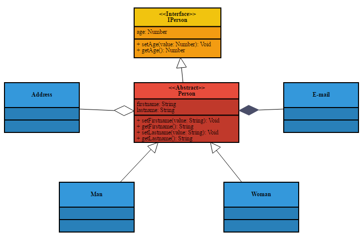

# Export entities
* export entities schema to entities class diagram

## Entities schema

```javascript
[
    {
        "name": "Person",
        "type": "object",
        "title": "Person",
        "properties": {
            "id": { "type": "integer", "format": "int64" },
            "matricule": { "type": "string", "format": "code", "title": "Matricule" },
            "nom": { "type": "string", "title": "Nom" },
            "prenom": { "type": "string", "title": "Prénom" },
            "age": { "type": "integer", "title": "Age" },
            "salaire": { "type": "number", "format": "money", "title": "Salaire" },
            "gender": { "$ref": "#/definitions/GenderDef" },
            "address": {
                "title": "address",
                "type": "array",
                "expand": true,
                "items": { "$ref": "#/definitions/Adress" }
            }
        },
        "primaryKey": "matricule",
        "relations": {
            "comptes": {
                "foreignEntity": "Compte",
                "foreignKey": "refUser",
                "key": "matricule",
                "multiplicity": "many"
            }
        },
        "definitions": {
            "Adress": {
                "type": "object",
                "title": "Adress",
                "name": "Adress",
                "properties": {
                    "country": {
                        "title": "country",
                        "type": "string"
                    },
                    "street": {
                        "title": "street",
                        "type": "string"
                    },
                    "zip": {
                        "title": "zip",
                        "type": "string"
                    }
                }
            },
            "GenderDef": {
                "title": "Genre",
                "type": "string",
                "enum": ["m", "f"],
                "enumNames": ["Masculin", "Féminin"]
            }
        }
    },
    {
        "name": "Compte",
        "type": "object",
        "title": "Compte",
        "properties": {
            "numero": {
                "type": "integer",
                "title": "Numéro"
            },
            "solde": {
                "type": "number",
                "format": "money",
                "title": "Solde"
            },
            "libelle": {
                "type": "string",
                "title": "Libellé"
            },
            "refUser": {
                "type": "string",
                "format": "code"
            }
        },
        "primaryKey": "numero"
    }
]
```

## entities class diagramm
Export entities schema to entities class diagram

